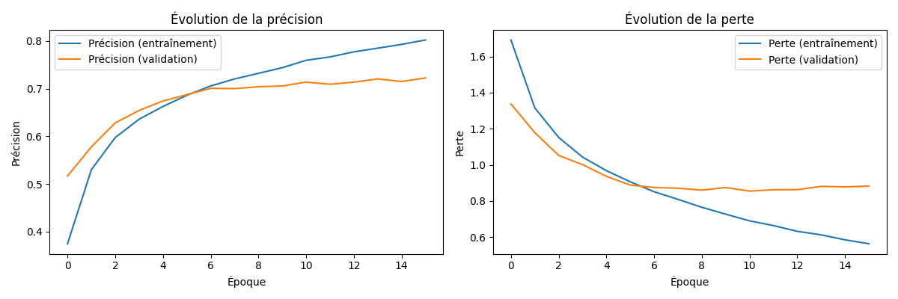

# Réseau neuronal convolutif de reconnaissance d'images

<br>


## Introduction aux CNN

Les réseaux de neurones convolutifs (CNN) sont une classe de réseaux de neurones artificiels principalement utilisés pour l'analyse d'images. Ils sont inspirés par le cortex visuel des animaux et sont particulièrement efficaces pour des tâches telles que la reconnaissance d'images, la classification et la détection d'objets.

Un CNN traite une image sous forme de matrice de pixels :

|   |   |
|----------------------------------|----------------------------------|
| Image sous forme classique       | Image traitée par le CNN         |

### Architecture de base

Un CNN est composé de plusieurs types de couches :

1. **Couches de convolution** : Appliquent des filtres (ou noyaux) pour extraire des caractéristiques locales de l'image. Chaque filtre détecte des motifs spécifiques comme les bords, les textures, etc.
2. **Couches de pooling** : Réduisent la dimensionnalité des données tout en conservant les informations importantes. Le pooling max est couramment utilisé, où la valeur maximale d'une région est conservée.
3. **Couches Fully Connected (FC)** : Après plusieurs couches de convolution et de pooling, les données sont aplaties et passées à travers des couches entièrement connectées pour la classification finale.

Voici un exemple de filtres (noyaux ou *kernels* en anglais) classiques pouvant être utilisés par un CNN :

|                                                 |                                                   |
|--------------------------------------------------------------------------------|----------------------------------------------------------------------------------|
| `[-10,0,10],[-10,0,10],[-10,0,10]` : Mise en évidence des traits **verticaux**.| `[10,10,10],[0,0,0],[-10,-10,-10]` : Mise en évidence des traits **horizontaux**.|

Exemple pour appliquer une matrice de filtre sur une image en Python :
```py
'''
Applique un filtre mettant en évidence les traits verticaux
'''
def filtre_2(image_nb):
    kernel = np.matrix([[-10,0,10],[-10,0,10],[-10,0,10]])
    print(kernel)
    img_1 = cv2.filter2D(image_nb, -1, kernel)
    plt.axis('off')
    plt.imshow(cv2.cvtColor(img_1, cv2.COLOR_BGR2RGB))
    plt.show()
```
Il existe un fabuleux site expliquant cela de manière interactive : [Setosa.io](https://setosa.io/ev/image-kernels/)

> **C'est ici que réside tout l'intérêt des CNN : les valeurs des filtres sont apprises pendant l'entraînement. Le réseau ajuste automatiquement ces valeurs pour extraire les caractéristiques les plus pertinentes pour la tâche donnée.**

### Fonctionnement

1. **Entrée** : Une image est fournie en entrée sous forme de matrice de pixels.
2. **Convolution** : Des filtres glissent sur l'image pour créer des cartes de caractéristiques.
3. **Pooling** : Réduit la taille des cartes de caractéristiques tout en conservant les informations importantes.
4. **Flattening** : Convertit les cartes de caractéristiques en un vecteur unidimensionnel.
5. **Fully Connected Layers** : Effectuent la classification finale en utilisant les caractéristiques extraites.
6. **Sortie** : Produit une probabilité pour chaque classe possible.

> _Je ne détaillerai pas chacune de ces étapes, car cela relève de connaissances que je n'ai pas encore entièrement acquises._

### Entraînement

Afin d'obtenir un modèle de CNN fonctionnel, il est nécessaire d'entraîner ce dernier sur de grands jeux de données nommés *datasets*. On peut trouver des *datasets* sur Internet, notamment sur [Kaggle](https://www.kaggle.com/datasets).

Les programmes d'entraînement des modèles se trouvent dans `/models`, et les modèles entraînés dans `/trained_models`.

Vous pouvez constituer votre propre *dataset*, mais cela est une tâche assez longue. Mon application n'est pas destinée premièrement à cela. J'explique cependant plus bas comment modifier correctement le code source de l'application et comment écrire les classes de modèles.

N'oubliez pas que **plus de données = meilleure efficacité de prédiction**.

Pour construire ces CNN, j'utiliserai l'un des outils les plus réputés et utilisés dans le domaine, à savoir **TensorFlow**. C'est un outil d'auto-apprentissage **open-source** développé par Google.

Exemple pour le dataset [CIFAR10](https://www.cs.toronto.edu/~kriz/cifar.html) : 
```py
from tensorflow.keras.datasets import cifar10
```
Dans mon cas, j'ai entraîné trois modèles différents que j'ai nommés d'après le *dataset* sur lequel ils ont été entraînés :
**CIFAR10**, **CIFAR100** et **COCO**.

<h3> Pour entraîner un modèle sur votre propre machine</h3>

*dans /models*

```zsh
python model_CIFAR10.py # Exemple avec CIFAR10
```
> Le modèle sera sauvegardé dans `/trained_models`

|                                                 |
|--------------------------------------------------------------------------------|
| Courbes représentants l'évolution des erreurs et succès lors de l'entrainement |

---
### Installation et usage

```zsh
git clone https://github.com/elias-utf8/convolutional-neural-network.git
cd convolutional-neural-network
pip install -r requirements.txt
python app.py 
```
---
### Pour aller plus loin

Si vous avez créé votre propre CNN et entraîné votre modèle, vous devrez ensuite écrire la classe d'exploitation du modèle sous */predict* ayant comme méthodes `predict_image()` et `summary()` pour le faire fonctionner sur l'application :

```py
    def summary(self):
        buffer = io.StringIO()
        self.model.summary(print_fn=lambda x: buffer.write(x + '\n'))
        return buffer.getvalue()

    def predict_image(self, image_path):
        img_array = preprocess_image(image_path, target_size=(32, 32))
        predictions = self.model.predict(img_array)
        predicted_class_index = np.argmax(predictions, axis=1)[0]
        predicted_class = self.cifar10_classes[predicted_class_index]
        confidence = predictions[0][predicted_class_index]
        return predicted_class, confidence
```
> Il sera certainement nécessaire d'adapter ces méthodes selon les caractéristiques de votre modèle.

Enfin dans `app.py` vous pourrez importer votre classe de modèle et écrire le code nécessaire
```py
from predict.CIFAR10 import CIFAR10Predictor
from predict.CIFAR100 import CIFAR100Predictor
from predict.COCO import COCOPredictor
from predict.MOBILNET import MobileNetPredictor
# Ajout de votre classe : from predict.MODELE import ModelePredictor

```

```py
        self.dataset_dropdown = ctk.CTkOptionMenu(
            master=control_frame,
            values=["CIFAR10", "CIFAR100", "COCO (Not recommanded)", "MobilNet (recommanded)"], # Ajout de l'option pour sélectionner votre modèle ["Votre modele"]
            variable=self.dataset_var,
            width=200,
            fg_color="grey",
            button_color="grey",
            text_color="white"
        )
```
```py
    def ChargerMODELE(self): 
        self.predictor = None
        self.predictor = ModelePredictor()
        self.ChangerTexte(self.predictor.summary())
    """
    ...

    """
    if selected_dataset == "Votre modele":
      self.Charger_MODELE()
```
Votre modèle entrainé est prêt a etre utilisé!

