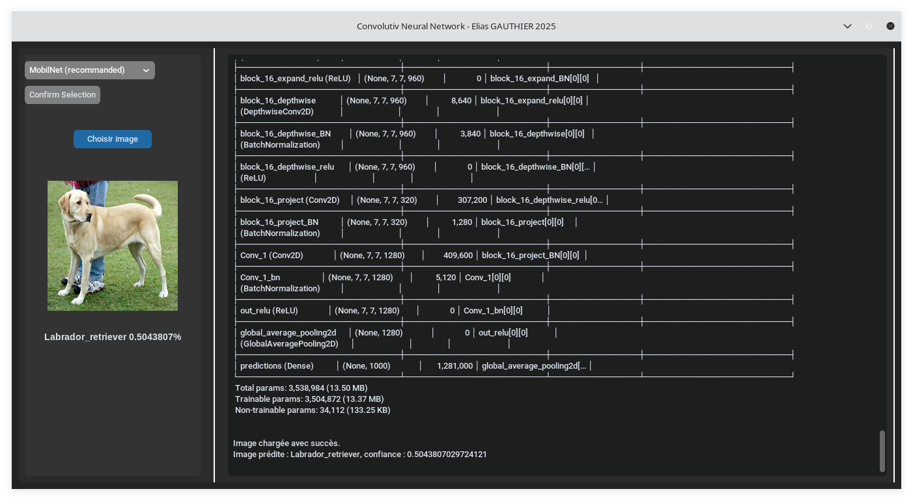
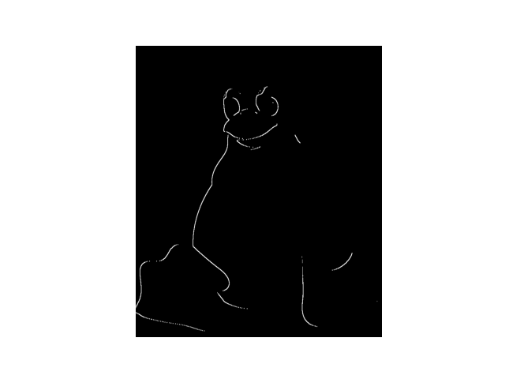
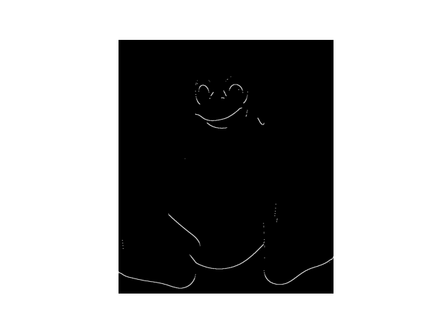

# Réseau neuronal convolutif de reconaissance d'images

  
  &nbsp;&nbsp;&nbsp;
  

 

***Attention : la documentation du projet est encore en cours***

## Introduction aux CNN

Les réseaux de neurones convolutifs (CNN) sont une classe de réseaux de neurones artificiels principalement utilisés pour l'analyse d'images. Ils sont inspirés par le cortex visuel des animaux et sont particulièrement efficaces pour des tâches telles que la reconnaissance d'images, la classification, et la détection d'objets.

### Architecture de base

Un CNN est composé de plusieurs types de couches :

1. **Couches de Convolution** : Appliquent des filtres (ou noyaux) pour extraire des caractéristiques locales de l'image. Chaque filtre détecte des motifs spécifiques comme les bords, les textures, etc.
2. **Couches de Pooling** : Réduisent la dimensionnalité des données tout en conservant les informations importantes. Le pooling max est couramment utilisé, où la valeur maximale d'une région est conservée.
3. **Couches Fully Connected (FC)** : Après plusieurs couches de convolution et de pooling, les données sont aplaties et passées à travers des couches entièrement connectées pour la classification finale.

Voici un exemple de filtres (noyaux ou kernel en anglais) classiques pouvant etre utilisés par un CNN : 

|  |  |
|---------------------------------|---------------------------------|
| Texte                           | Texte                           |

### Fonctionnement

1. **Entrée** : Une image est fournie en entrée sous forme de matrice de pixels.
2. **Convolution** : Des filtres glissent sur l'image pour créer des cartes de caractéristiques.
3. **Pooling** : Réduit la taille des cartes de caractéristiques tout en conservant les informations importantes.
4. **Flattening** : Convertit les cartes de caractéristiques en un vecteur unidimensionnel.
5. **Fully Connected Layers** : Effectuent la classification finale en utilisant les caractéristiques extraites.
6. **Sortie** : Produit une probabilité pour chaque classe possible.

### Entrainement 

Afin d'obtenir un modèle de CNN fonctionnel il est nécessaire d'entrainer ce dernier sur de grand jeux de données nommées datasets. On peut trouver des datasets sur internet tel que sur [Kaggle](https://www.kaggle.com/datasets).

Les programmes d'entrainements des modèles sont dans `/models` et les modèles entrainés sont dans `/trained_models`

Vous pouvez constituer votre propre dataset mais cela est une tache assez longue. N'oubliez pas que + de données + efficacité de prédiction.
Grâce a Tensorflow l'on peut accèder a des datasets directement depuis l'import de la bibliothèque.

---
## Implémentation
Dans mon cas, j'ai entrainé 3 modèles différent que j'ai nommées avec le dataset sur lequel ils se sont exercés. Soit, CIFAR10, CIFAR100 ainsi que COCO. 
